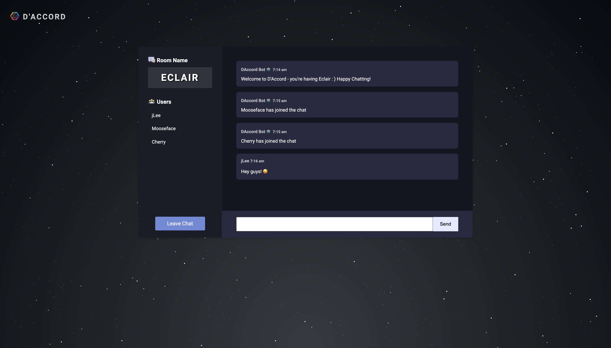

# D'Accord Chat

Express | Node | Socket.io

Realtime chat application using [Node.js](https://nodejs.dev/), [Express](https://expressjs.com/) and [Socket.io](https://socket.io/) on the backend and vanilla JS on the frontend.
